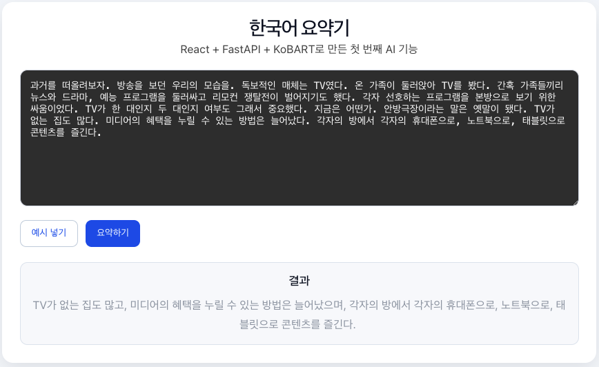

# 한국어 텍스트 요약기

긴 한국어 글을 붙여넣으면 **KoBART**(`gogamza/kobart-summarization`)로 요약해 주는 웹 앱.
**React(Vite)** 프론트엔드와 **FastAPI** 백엔드로 구성.

## 설치

**백엔드** (`backend` 폴더)

- Python 가상환경을 만든 뒤:
- `pip install -r requirements.txt`

**프론트엔드** (`frontend` 폴더)

- `npm install`

> 첫 요약 시 Hugging Face에서 모델을 내려받으므로 시간이 걸리고, `torch`·`transformers` 사용으로 디스크·메모리가 필요합니다.

## 실행

터미널을 두 개 띄운 뒤 각각 실행합니다.

1. 백엔드: `backend`에서 `fastapi dev main.py` → 보통 `http://127.0.0.1:8000`
2. 프론트: `frontend`에서 `npm run dev` → 보통 `http://localhost:5173`

브라우저에서는 **프론트 주소**로 접속합니다.

## 실행 화면

